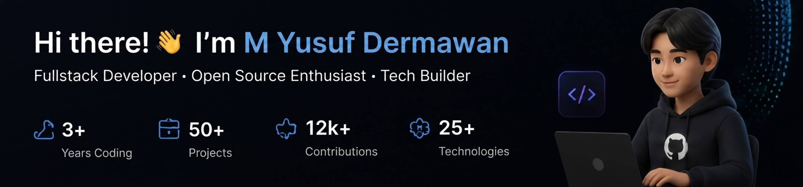

## 👨‍💻 About Me
I'm a passionate Fullstack Developer who loves turning ideas into real products. I enjoy working with modern technologies, building scalable applications, and contributing to open source projects.

<table>
<tr>

<td align="center" valign="top" width="25%">

🌏

### Based In

Indonesia

</td>

<td align="center" valign="top" width="25%">

💼

### Open To

Internships & Opportunities

</td>

<td align="center" valign="top" width="25%">

⚡

### Focused On

Software Engineering

</td>

<td align="center" valign="top" width="25%">

🎯

### 2026 Goal

Become Job Ready

</td>

</tr>
</table>

# 🛠 Tech Stack

<table>
<tr>

<td valign="top">

### 🎨 Frontend

- React
- Next.js
- TypeScript
- Tailwind CSS
- Redux

</td>

<td valign="top">

### ⚙ Backend

- Node.js
- Express.js
- NestJS
- GraphQL
- Socket.io

</td>

<td valign="top">

### 🗄 Database

- PostgreSQL
- MongoDB
- Redis
- Prisma
- Supabase

</td>

<td valign="top">

### 🚀 DevOps

- Docker
- Kubernetes
- AWS
- GitHub Actions
- Nginx

</td>

<td valign="top">

### 🔥 Other

- Python
- Go
- Rust
- Web3.js
- Solidity

</td>

</tr>
</table>

# 🚀 Featured Projects

<table>
<tr>

<td width="50%">

### 🌐 DevConnect

Platform untuk developer saling terhubung dan berbagi pengetahuan.

**Tech Stack**

`Next.js` `TypeScript` `Tailwind`

⭐ 1.2k Stars

</td>

<td width="50%">

### 💼 SaaS Starter Kit

Template SaaS siap produksi dengan auth dan payment.

**Tech Stack**

`Next.js` `Prisma` `Stripe`

⭐ 2.1k Stars

</td>

</tr>

<tr>

<td width="50%">

### 🤖 AI Assistant

AI Chat Assistant menggunakan OpenAI API.

**Tech Stack**

`Next.js` `OpenAI` `Tailwind`

⭐ 980 Stars

</td>

<td width="50%">

### 💰 FinTrack

Aplikasi manajemen keuangan pribadi.

**Tech Stack**

`React` `Node.js` `MongoDB`

⭐ 610 Stars

</td>

</tr>

</table> 
